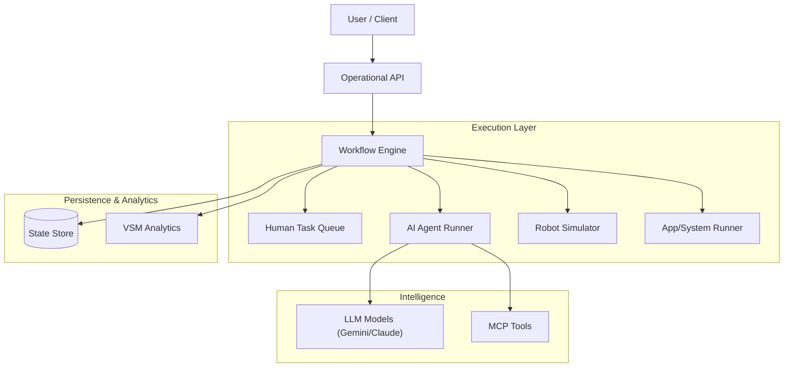

# Agentic Workflow Architecture (AWA)

> **A system for a new way to automate enterprise workflow in the agentic era, natively made to work with AI.**

AWA is a next-generation specification and framework designed to build, run, and visualize **AI-native business processes**. It moves beyond traditional BPMN by treating **AI Agents** as first-class citizens alongside humans, robots, and software systems.

---

## 🚀 What is AWA?

In the age of Generative AI, traditional workflows are too rigid. Agents need **autonomy**, **context**, and **tools**.

**AWA (Agentic Workflow Architecture)** provides the standard for defining queryable, maintainable, and intelligent workflows where:
- **AI Agents** reason and use tools (MCP) to complete tasks.
- **Humans** are loop-in for critical decisions and approvals.
- **Robots** execute physical world actions.
- **Systems** handle high-speed deterministic processing.

It solves the "Black Box" problem of AI agents by providing a **structured, observable, and queryable** backbone for agent orchestration.

---

## ⚡ Superpowers

- **🤖 First-Class AI Agents**: Native support for LLM-backed actors with specific personas, tool proficiencies (MCP), and context awareness.
- **🧠 Context-Aware Memory**: Shared state, message passing, and blackboard patterns for multi-agent collaboration.
- **📊 Value Stream Intelligence**: Built-in Lean/Six Sigma analytics that automatically detect waste (DOWNTIME) and track value-added time.
- **🛑 Human-in-the-Loop**: Seamless handoffs to humans for approvals, reviews, and complex decision-making via a dedicated Kanban interface.
- **🔍 Queryable Architecture**: The entire workflow is a queryable graph. Ask "Which steps involve high-risk financial data?" or "Show me all activities performed by Gemini 3.0 Pro".

---

## 📦 Features

- **Multi-Actor Support**: Orchestrate Humans, AI Agents, Robots, and Applications in a single flow.
- **Smart Decision Nodes**: DMN-inspired decision tables with FEEL expression support for complex business logic.
- **Visualizations**:
    - **2D/3D Diagrams**: ReactFlow and Babylon.js rendering.
    - **Kanban Board**: Real-time task management for human actors.
- **Production Ready**:
    - **Resilience**: Automatic retries and Dead Letter Queues (DLQ).
    - **Security**: RBAC (Role-Based Access Control) with JWT and API Keys.
    - **Persistence**: Checkpointing and state restoration (PostgreSQL/File).
- **Polyglot SDKs**: Full support for **TypeScript** and **Python**.

---

## 🏁 Quick Start

### 1. Install

```bash
# TypeScript SDK
npm install @awa/sdk

# Python SDK
pip install awa
```

### 2. Build a Workflow

Create a workflow where an AI agent analyzes an order, and a human approves it.

**TypeScript:**
```typescript
import { workflow } from '@awa/sdk';

const orderProcess = workflow('Order Fulfillment', '1.0.0')
  .context('order_data', { type: 'data', sync_pattern: 'shared_state' })
  
  // 1. AI Analyzes Order
  .activity('Analyze Order', {
    role_id: 'ai-analyst',
    actor_type: 'ai_agent',
    inputs: ['order_id'],
    tools: ['inventory-check-tool'] // MCP Tool
  })
  
  // 2. Human Approves (if risk detected)
  .activity('Approve High Value', {
    role_id: 'manager',
    actor_type: 'human',
    description: 'Review high-value order for fraud risk'
  })
  
  .edge('Analyze Order', 'Approve High Value')
  .build();
```

### 3. Run It

Run the workflow using the CLI engine.

```bash
# Run with verbose logging
awa run workflow.awa.json --verbose --key YOUR_GEMINI_API_KEY
```

---

## 🏗️ Architecture

AWA is built on a modular architecture designed for scalability and observability.



---

## 🛠️ Project Structure

The repository is organized into SDKs, Specifications, and Applications.

| Directory | Description |
|-----------|-------------|
| `sdk/typescript` | Core **TypeScript SDK** and CLI tools. |
| `sdk/python` | **Python SDK** for data science and AI engineers. |
| `apps/kanban-web` | **Kanban Web App** (Next.js) for human task management. |
| `spec/` | Official specifications (JSON Schema, OpenAPI, Avro, DDL). |
| `examples/` | End-to-end examples (Insurance, Retail, Banking). |

---

## 🖥️ Kanban Web Application

AWA includes a modern **Kanban Web Application** for managing human tasks.

- **Real-time Updates**: Tasks appear instantly as agents assign them.
- **Rich Task Details**: View full context, actor metadata, and input/output data in a responsive modal.
- **Visual Cues**: Distinct visual styles for tasks created by AI Agents, Robots, or Systems.

To run the Kanban app locally:

```bash
cd apps/kanban-web
npm run dev
# Open http://localhost:3000
```

---

## 📚 Documentation & Resources

- **[Skill Definition](SKILL.md)**: Comprehensive guide for AI assistants.
- **[CLI Guide](sdk/typescript/docs/cli-guide.md)**: Command-line reference.
- **[API Reference](sdk/typescript/docs/operational-api.md)**: REST API documentation.
- **[Examples](examples/)**: Explore real-world use cases like Insurance Claims and Retail Distribution.

---

## 📄 License

Apache 2.0

## ✍️ Authors

- [Yannick HUCHARD](https://yannickhuchard.com)